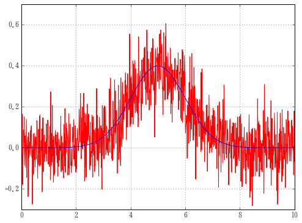
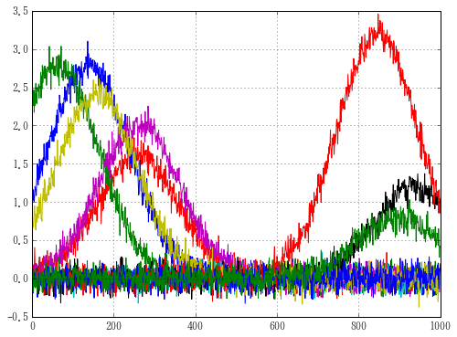

# 準備

## モジュールのインポート

plottxtは以下のモジュールも同時にインポートする。

    import pandas as pd
    import numpy as np
    import matplotlib.pyplot as plt
    from scipy import stats
    import glob
    import json
    from tqdm import tqdm

tqdmはAnacondaにプリインストールされていないかもしれないので

    conda install tqdm

または

    conda install -c conda-forge tqdm=4.10.0

をコンソールに打ち込んでインストール


```python
import plottxt as pt
```

## グリッド常に表示

グラフ設定


```python
%matplotlib inline
import matplotlib as mpl
mpl.rc('axes', grid=True)
```

## サンプルデータ


```python
from scipy.stats import norm
n = 1001
x = np.linspace(0,10, n)
m = int(len(x)/2)
y = norm.pdf(x,loc=x[m])
```

ノイズを載せる。


```python
from numpy import random
yn = y + 0.1 * random.randn(1001)
plt.plot(x,yn)
plt.plot(x,y)
```


    [<matplotlib.lines.Line2D at 0xf525208>]





```python
df = pd.DataFrame(np.empty(n))
df.index
for i in range(10):
    m = random.choice(x)   # ランダムに正規分布の平均を決める
    a = random.randint(10)  # ランダムに正規分布の最大値を決める
    y = a * norm.pdf(x, loc=m)  # 元のカーブ
    yn = y + 0.1 * random.randn(n)  # ノイズをのせる
    df[i] = pd.DataFrame(yn)  # データフレームに格納
df.plot(legend=False)
```


    <matplotlib.axes._subplots.AxesSubplot at 0x12004780>





```python

```
