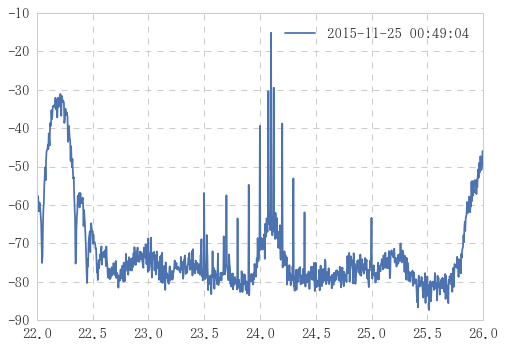
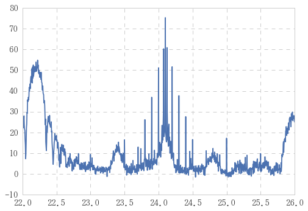

```python
import plottxt as pt
```


```python
path = pt.param['in']; path
```


    '//sampanet.gr.jp/DFS/ShareUsers/UserTokki/Common/VLFtrace/Common/VLFtrace/data4/trace/'


```python
file = '20151125_004904.txt'
```


```python
files = ('20151125_002404.txt',
        '20151214_225858.txt',
        '20161013_091345.txt')
```


```python
pt.spectrum(path + file).plot()
```


    <matplotlib.axes._subplots.AxesSubplot at 0xd7e6940>


```python
pt.spectrum_many([path + i for i in files]).plot()
```


    <matplotlib.axes._subplots.AxesSubplot at 0xc6b2048>





```python
df.noisefloor()
```


    2015-11-25 00:24:04    -80.20
    2015-12-14 22:58:58    -98.26
    2016-10-13 09:13:45   -106.72
    dtype: float64


```python
df = pt.spectrum_many([path + i for i in files])
dff = df - df.noisefloor()
dff.plot()
```


    <matplotlib.axes._subplots.AxesSubplot at 0xd8bd6a0>


```python
dff.max(axis=1).plot()

```


    <matplotlib.axes._subplots.AxesSubplot at 0xd8b4a58>





```python

```
