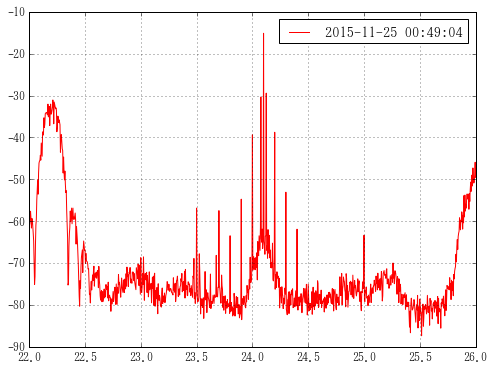
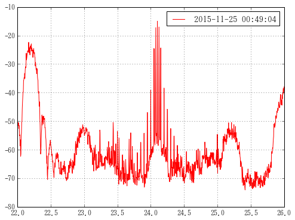
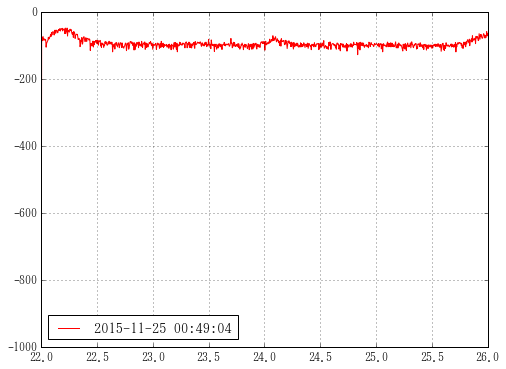
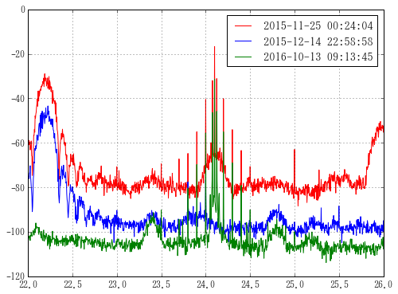
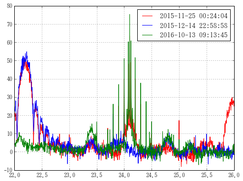
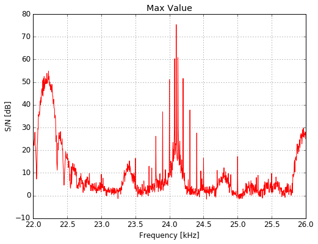

# 使い方
`shift`+`enter`で「セルの実行」+「次のセルへ移動」

# 準備

* グラフのインライン化
> %matplotlib.inline
* モジュールのインポート
> `import plottxt as pt`


```python
%matplotlib inline
import plottxt as pt
```

plottxtは以下のモジュールも同時にインポートする。

* import pandas as pd
* import numpy as np
* import matplotlib.pyplot as plt
* from scipy import stats
* import glob
* import json
* from tqdm import tqdm

tqdmはAnacondaにプリインストールされていないかもしれないので

> `conda install tqdm`

または

> ` conda install -c conda-forge tqdm=4.10.0 `

をコンソールに打ち込んでインストール
___

gridを常に表示するコマンドは以下のように`mpl.rc('axes', grid=True)`


```python
import matplotlib as mpl
mpl.rc('axes', grid=True)
```

次に、パスの確認。

このディレクトリに入ったファイルだけグラフ化できる。


```python
path = pt.param['in']; path
```


# 単数ファイルの処理

ファイル名を指定


```python
file = '20151125_004904.txt'
```

spectrum関数は1ファイルのフルパスに対し、一つのpandas.Seriesを返す。


```python
pt.spectrum(path + file)
```


<div>
<table border="1" class="dataframe">
  <thead>
    <tr style="text-align: right;">
      <th></th>
      <th>2015-11-25 00:49:04</th>
    </tr>
  </thead>
  <tbody>
    <tr>
      <th>22.000</th>
      <td>-60.80</td>
    </tr>
    <tr>
      <th>22.004</th>
      <td>-60.80</td>
    </tr>
    <tr>
      <th>22.008</th>
      <td>-59.67</td>
    </tr>
    <tr>
      <th>22.012</th>
      <td>-57.65</td>
    </tr>
    <tr>
      <th>22.016</th>
      <td>-59.37</td>
    </tr>
    <tr>
      <th>22.020</th>
      <td>-61.67</td>
    </tr>
    <tr>
      <th>22.024</th>
      <td>-59.38</td>
    </tr>
    <tr>
      <th>22.028</th>
      <td>-59.54</td>
    </tr>
    <tr>
      <th>22.032</th>
      <td>-61.11</td>
    </tr>
    <tr>
      <th>22.036</th>
      <td>-62.91</td>
    </tr>
    <tr>
      <th>22.040</th>
      <td>-64.76</td>
    </tr>
    <tr>
      <th>22.044</th>
      <td>-70.19</td>
    </tr>
    <tr>
      <th>22.048</th>
      <td>-75.13</td>
    </tr>
    <tr>
      <th>22.052</th>
      <td>-73.28</td>
    </tr>
    <tr>
      <th>22.056</th>
      <td>-65.72</td>
    </tr>
    <tr>
      <th>22.060</th>
      <td>-60.98</td>
    </tr>
    <tr>
      <th>22.064</th>
      <td>-59.55</td>
    </tr>
    <tr>
      <th>22.068</th>
      <td>-54.91</td>
    </tr>
    <tr>
      <th>22.072</th>
      <td>-52.64</td>
    </tr>
    <tr>
      <th>22.076</th>
      <td>-50.15</td>
    </tr>
    <tr>
      <th>22.080</th>
      <td>-53.57</td>
    </tr>
    <tr>
      <th>22.084</th>
      <td>-48.45</td>
    </tr>
    <tr>
      <th>22.088</th>
      <td>-46.13</td>
    </tr>
    <tr>
      <th>22.092</th>
      <td>-45.68</td>
    </tr>
    <tr>
      <th>22.096</th>
      <td>-45.49</td>
    </tr>
    <tr>
      <th>22.100</th>
      <td>-44.28</td>
    </tr>
    <tr>
      <th>22.104</th>
      <td>-45.44</td>
    </tr>
    <tr>
      <th>22.108</th>
      <td>-41.35</td>
    </tr>
    <tr>
      <th>22.112</th>
      <td>-42.95</td>
    </tr>
    <tr>
      <th>22.116</th>
      <td>-44.51</td>
    </tr>
    <tr>
      <th>...</th>
      <td>...</td>
    </tr>
    <tr>
      <th>25.884</th>
      <td>-61.92</td>
    </tr>
    <tr>
      <th>25.888</th>
      <td>-58.77</td>
    </tr>
    <tr>
      <th>25.892</th>
      <td>-60.41</td>
    </tr>
    <tr>
      <th>25.896</th>
      <td>-53.90</td>
    </tr>
    <tr>
      <th>25.900</th>
      <td>-59.01</td>
    </tr>
    <tr>
      <th>25.904</th>
      <td>-53.79</td>
    </tr>
    <tr>
      <th>25.908</th>
      <td>-57.61</td>
    </tr>
    <tr>
      <th>25.912</th>
      <td>-56.01</td>
    </tr>
    <tr>
      <th>25.916</th>
      <td>-56.91</td>
    </tr>
    <tr>
      <th>25.920</th>
      <td>-54.55</td>
    </tr>
    <tr>
      <th>25.924</th>
      <td>-53.52</td>
    </tr>
    <tr>
      <th>25.928</th>
      <td>-54.63</td>
    </tr>
    <tr>
      <th>25.932</th>
      <td>-54.77</td>
    </tr>
    <tr>
      <th>25.936</th>
      <td>-53.59</td>
    </tr>
    <tr>
      <th>25.940</th>
      <td>-57.17</td>
    </tr>
    <tr>
      <th>25.944</th>
      <td>-53.40</td>
    </tr>
    <tr>
      <th>25.948</th>
      <td>-55.31</td>
    </tr>
    <tr>
      <th>25.952</th>
      <td>-52.47</td>
    </tr>
    <tr>
      <th>25.956</th>
      <td>-50.70</td>
    </tr>
    <tr>
      <th>25.960</th>
      <td>-52.90</td>
    </tr>
    <tr>
      <th>25.964</th>
      <td>-49.04</td>
    </tr>
    <tr>
      <th>25.968</th>
      <td>-51.65</td>
    </tr>
    <tr>
      <th>25.972</th>
      <td>-50.88</td>
    </tr>
    <tr>
      <th>25.976</th>
      <td>-47.31</td>
    </tr>
    <tr>
      <th>25.980</th>
      <td>-49.71</td>
    </tr>
    <tr>
      <th>25.984</th>
      <td>-50.92</td>
    </tr>
    <tr>
      <th>25.988</th>
      <td>-50.58</td>
    </tr>
    <tr>
      <th>25.992</th>
      <td>-48.82</td>
    </tr>
    <tr>
      <th>25.996</th>
      <td>-45.95</td>
    </tr>
    <tr>
      <th>26.000</th>
      <td>-49.58</td>
    </tr>
  </tbody>
</table>
<p>1001 rows × 1 columns</p>
</div>


plot()メソッドでグラフの表示。


```python
pt.spectrum(path + file).plot()
```


    <matplotlib.axes._subplots.AxesSubplot at 0xbb5f518>





`parameter.json`に格納されたfreq関連の値から適当にインデックスを割り振ってくれる。

* `freq_center`: 中心周波数
* `freq_span`: 周波数のスパン
* `number_of_rows`: データ列は何行あるか。

`parameter.json`を開いてこれらの値をいじれば、スパンを変えた日付2016/10/28以降のデータもグラフかできます。

引数`columns`に`max`, `min`を打つと、txtファイルのMax値, Min値に切り替え可能。

(以降は使わないけど、オプションとしてあることを示しておきます。大文字小文字無視)


```python
pt.spectrum(path + file, columns='max').plot()
pt.spectrum(path + file, columns='mIn').plot()
```


    <matplotlib.axes._subplots.AxesSubplot at 0xc4a3710>








# 複数ファイルの処理

## 電界強度のグラフ化
グラフ化したい複数のファイルを
()の中にくくって複数指定する。


```python
files = ('20151125_002404.txt',
        '20151214_225858.txt',
        '20161013_091345.txt')
```

pythonの内包表記使ってpathを足したフルパスのリストを作成し、
それを`spectrum_many`関数へ渡す。


```python
df = pt.spectrum_many([path + i for i in files])
df.plot()
```

    .txt形式からのロード...少々時間がかかります。
    

    100%|███████████████████████████████████████████████████████████████████████████| 3/3 [00:00<00:00, 68.16it/s]
    


    <matplotlib.axes._subplots.AxesSubplot at 0xbd19d30>





## ノイズフロア
ノイズフロアを知りたいときは、pandas.DataFrameまたはpandas.Seriesの後に`.noisefloor()`


```python
df.noisefloor()
```


    2015-11-25 00:24:04    -80.20
    2015-12-14 22:58:58    -98.26
    2016-10-13 09:13:45   -106.72
    dtype: float64


## SN比
さきほどのdfからノイズフロアを引き算してやれば、SN比が出る。


```python
sn = df - df.noisefloor()
sn.plot()
```


    <matplotlib.axes._subplots.AxesSubplot at 0xc5b1b38>





上の表記は

```python
df -= df.noisefloor()
```

としてもdfからノイズフロアを引き算できる。

そのときプロットするときは`df.plot()`とする。

## 最大値だけプロット
SN比のデータ集合である`sn`から最大の値だけを抜き出すとき、
`max(axis=1)`メソッドでそれぞれの周波数の最大値だけを抜き出す。
(`axis=0`はそれぞれの日時の最大値)


```python
sn.max(axis=1).plot(title='Max Value')

```


    <matplotlib.text.Text at 0xe37a240>





plotメソッドの中にtitleというオプションがあるので、グラフの上にタイトルを書くことができる。

ラベルを書くにはmatplotlib.pyplotのメソッドでxlabel, ylabelがあるので、そこでラベルを指定できる。

# さらに複数のファイルを処理
人力で打ち込める数はその人の努力しだいだが、せいぜい10個程度のコピペで飽きる。

そこで正規表現によるファイルの検索も`plottxt.py`は実装している。

## ファイル名一覧の表示
globモジュールを使用することで、正規表現によるファイルの取得が可能


```python
import glob
glob.glob(path + '*')[:10]  # すべてのファイルを取得。最初の10個だけ表示
```


```python
glob.glob(path+'20160112_05*')  # 2016年1月12日5時台のファイル名を取得
```


globで作ったリストをそのまま`spectrum_many`へ突っ込めばすべてを重ねたグラフが出来上がる。


```python
gdf = pt.spectrum_many(glob.glob(path+'20160112_05*'))
gdf.plot(legend=False)
```

    .txt形式からのロード...少々時間がかかります。
    

    100%|█████████████████████████████████████████████████████████████████████████| 12/12 [00:00<00:00, 50.00it/s]
    


    <matplotlib.axes._subplots.AxesSubplot at 0xc511358>


`plot`メソッドのオプションで`legend=False`を指定すると凡例が消える。


```python
gdf -= gdf.noisefloor()  # ノイズフロアを引き算
gdf.max(axis=1).plot(legend=False, title='Max')  #%%! 各周波数ごとの最大値を出してプロット

```
